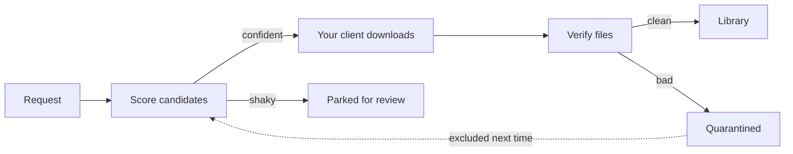

<div align="center">


**Request music. Own everything.**

Self-hosted music requests and discovery with a built-in library and download engine that drives your own clients. No Lidarr. One container.

[](LICENSE)
[](https://github.com/DroppedNeedle/DroppedNeedle)
[](https://hub.docker.com/r/droppedneedle/droppedneedle)
[](https://discord.gg/B5suDg7gu2)
[](https://www.droppedneedle.com/)

[Docs](https://www.droppedneedle.com/) | [Discord](https://discord.gg/B5suDg7gu2) | [Issues](https://github.com/DroppedNeedle/DroppedNeedle/issues) | [Sponsor](https://github.com/sponsors/HabiRabbu)

</div>

---

## hify fork credit

This repository is **hify**, a fork of [DroppedNeedle](https://github.com/DroppedNeedle/DroppedNeedle). DroppedNeedle's original branding, upstream references, and AGPL-3.0 licence notices are intentionally retained.

---

Search the full MusicBrainz catalogue, request the album or the single track you actually want, and DroppedNeedle takes it from there: it drives your own download client, scores the candidates, verifies every file, and shelves the result in your library. Play it back from Jellyfin, Navidrome, Plex, or local files, or let any Subsonic or Jellyfin app play from you.

> [!NOTE]
> DroppedNeedle only drives a download client you supply and run yourself over its local HTTP API. It never joins a P2P network, ships no indexers, and hosts no audio. What you fetch, and what your client shares back, is your call and your responsibility.

## Contents

- [See it](#see-it)
- [Quick start](#quick-start)
- [What it does](#what-it-does)
- [Download sources](#download-sources)
- [Configuration](#configuration)
- [Troubleshooting](#troubleshooting)
- [For builders](#for-builders)
- [Support and license](#support-and-license)

---

## See it


<details>
<summary>More screenshots</summary>


</details>

---

## Quick start

You need Docker, a music library, and a download client. The example below uses slskd; [SABnzbd](https://sabnzbd.org/) with Newznab indexers works too. DroppedNeedle runs neither for you. See [slskd](#slskd) and [Usenet](#usenet).

### 1. Save this compose file

Images live on [Docker Hub](https://hub.docker.com/r/droppedneedle/droppedneedle) as `droppedneedle/droppedneedle:latest`.

```yaml
services:
  droppedneedle:
    image: droppedneedle/droppedneedle:latest
    container_name: droppedneedle
    environment:
      - PUID=1000            # run `id` on your host to find your user/group ID
      - PGID=1000
      - UMASK=027            # secure default; 002 for trusted group-writable media
      - PORT=8688
      - TZ=Etc/UTC           # e.g. Europe/London, America/New_York
      - SLSKD_DOWNLOADS_PATH=/data/slskd/complete
    ports:
      - "8688:8688"
    volumes:
      - ./config:/app/config
      - ./cache:/app/cache
      - ./plugins:/app/plugins  # omit and installed plugins vanish on recreate
      # One shared parent mount keeps the library and completed downloads on one
      # boundary so imports move fast. Do not nest extra binds under /data.
      - /path/to/media:/data:rw
    restart: unless-stopped
    healthcheck:
      test: ["CMD", "curl", "-f", "http://localhost:8688/health"]
      interval: 30s
      timeout: 10s
      start_period: 10m
```

> [!TIP]
> The full annotated compose, including an optional slskd sidecar, is [docker-compose.example.yml](docker-compose.example.yml).

### 2. Start it

```bash
docker compose up -d
```

Then open [http://localhost:8688](http://localhost:8688).

### 3. First run

1. Create the first admin account. This happens once.
2. Add your library path under Settings > Library, using the in-container path (e.g. `/data/music`).
3. Add your download client under Settings > Download Client, then Test and Save.
4. Hit Scan on Settings > Library. The scan reads and identifies files without renaming or retagging anything.
5. Search the catalogue, open an album, and Request it. Watch it land live on the Downloads page.

<details>
<summary>Updating and the dev tag</summary>

Update like any other container:

```bash
docker compose pull
docker compose up -d
```

The first boot after an upgrade can take a while on large libraries. DroppedNeedle upgrades a copy of the database, checks it, and only then swaps it in, keeping a backup under `/app/cache/upgrade-backups`. If validation fails it restores the backup instead of starting half upgraded. Check the container log before retrying a newer image.

A `:dev` tag (`droppedneedle/droppedneedle:dev`) is built from `main` on every push and may break. Pin a commit with `:dev-<short-sha>`.

</details>

---

## What it does

| Thing | What you get |
|-|-|
| Request | Whole albums or single tracks from the MusicBrainz catalogue, with an approval queue for the User role |
| Wanted | Failed and partial requests get re-searched on their own until a verified copy shows up |
| Quality | Per-format quality floors, automatic upgrades when a better copy appears, storage caps and quotas |
| Player | Queue, shuffle, 10-band EQ, embedded lyrics, live now-playing updates |
| Discovery | Trending, charts, genre browsing, recommendations from your ListenBrainz and Last.fm history, and a weekly mix that can queue up to five missing albums |
| Live events | Ticketmaster and Skiddle gig alerts for artists you follow, each user with their own cities |
| Following | New-release radar with optional auto-download, release-type filters, and sidebar badges |
| Library | Browse, filter, rescan, and remove albums; unmatched files wait in a manual-review queue |
| Free Music | Internet Archive items under Creative Commons or public-domain licences, licence shown up front, no account or API key, off with one toggle |
| Drop imports | Drag in a zip or loose files from anywhere you buy music; identified, tagged, and shelved, or held for a manual match |
| Playlists | Mix Jellyfin, Navidrome, Plex, local, YouTube, and Spotify imports in one place, share read-only with one toggle |
| Library Management | Optional MusicBrainz Picard-style tags, artwork, and organization behind an admin preview with dry run and typed confirmation. Off until you enable it |

How a request moves:



The engine searches your client, ranks candidates, and auto-accepts a confident match. Close calls park for review instead of guessing. Every file is verified (readable tags, sane duration, optional fingerprint check) before it touches the library, and bad sources get quarantined so they stop winning.

| Direction | What plugs in |
|-|-|
| In | Your slskd, your SABnzbd with your Newznab indexers, Internet Archive free licences, and drop imports. Identity from MusicBrainz and AcoustID, artwork from the Cover Art Archive and AudioDB |
| Out | Jellyfin, Navidrome, Plex, local files, and YouTube previews, plus OpenSubsonic and Jellyfin APIs so apps like Symfonium, Finamp, Feishin, Amperfy, Jellify, and Manet can play from you |
| Around | ListenBrainz and Last.fm scrobbling, Spotify playlist import, Ticketmaster and Skiddle gigs, Deezer and iTunes preview clips, and purchase links that put Bandcamp first |

---

## Download sources

### slskd

DroppedNeedle talks to your own running slskd over its local HTTP API (`X-API-Key`). You bring slskd; DroppedNeedle drives it.

- Use slskd 0.25.0 or newer (0.25.1 is the verified pin: `slskd/slskd:0.25.1`), with a Soulseek account inside it.
- Give DroppedNeedle the URL plus API key under Settings > Download Client, then Test and Save. The key is stored encrypted and never logged.

> [!IMPORTANT]
> Soulseek bans clients that share nothing, so give slskd at least one shared folder or searches and downloads fail. Everything in a shared folder goes out to the network. Choose it like you mean it.

The downloads path is where most installs go wrong. Three rules:

1. Expose slskd's completed-downloads directory to DroppedNeedle read-write under one shared parent mount (e.g. library at `/data/music`, completions at `/data/slskd/complete`).
2. Point `SLSKD_DOWNLOADS_PATH` at that exact directory, not its parent.
3. Skip nested binds under `/data`. Each one is a new mount boundary, which drops imports to the slower copy fallback.

<details>
<summary>Minimal slskd.yml essentials</summary>

```yaml
soulseek:
  username: your-soulseek-username
  password: your-soulseek-password

shares:
  directories:
    - /data/share   # required: share something or the network bans you

directories:
  downloads: /downloads   # the sidecar path; bind its host dir into DroppedNeedle too

web:
  authentication:
    api_keys:
      droppedneedle:
        key: choose-a-long-random-key
```

</details>

### Usenet

The second source is Usenet through SABnzbd with Newznab-compatible indexers (NZBGeek, NZBPlanet, NZB.su, Slug, and others). The engine searches your indexers, enqueues NZBs in your SABnzbd, and imports finished files through the same scoring, verification, and quarantine pipeline as slskd.

1. Expose SABnzbd's completed-downloads directory read-write, ideally under the same shared parent mount as the library so the [mount rules](#slskd) hold. In SABnzbd, point its Downloads folder setting at the matching path (e.g. `/data/sabnzbd/complete`).
2. Under Settings > Download Client, enable Usenet and enter your SABnzbd URL and API key.
3. Add each indexer URL plus API key under Settings > Indexers, then Test and Save each one.

slskd and Usenet can run side by side; the source priority control picks who goes first.

---

## Configuration

Everything user-editable lives in the web UI and lands in `config/config.json`. Environment is only for container basics:

| Variable | Default | What it is |
|-|-|-|
| `PUID` | `1000` | File owner inside the container (run `id` on the host) |
| `PGID` | `1000` | File group inside the container |
| `UMASK` | `027` | Creation mask for new files; `002` for trusted group-writable media |
| `PORT` | `8688` | Port the app listens on |
| `TZ` | `Etc/UTC` | Container timezone |
| `SLSKD_DOWNLOADS_PATH` | `/data/downloads/slskd` | Exact in-container path to slskd completions (the compose example uses `/data/slskd/complete`) |

<details>
<summary>Permissions and NAS notes</summary>

Keep `027` for a private box. Use `002` when DroppedNeedle and another trusted service in the same group both write the same media. Skip `000`: it makes new files writable by every local account the filesystem allows. `UMASK` shapes new files only; a move can keep the source mode the download client set.

Unraid commonly uses `nobody:users` (PUID 99, PGID 100). Point PUID and PGID at whoever owns the mounted config and cache paths. The container skips ownership changes it cannot make, which covers FUSE, NFS, CIFS, and rootless setups. A read-only config or cache mount refuses to start before anything gets written.

`/app/config` and `/app/cache` must be writable and honor SQLite locking, `fsync`, and atomic replacement. Plain bind mounts, named volumes, local Unraid shares, and TrueNAS datasets with normal permissions all qualify. NFS and SMB mounts only work when they support the same file locking SQLite needs. On Docker Desktop for Windows, prefer named volumes for those two paths.

</details>

| Data | Container path | Notes |
|-|-|-|
| Config and database | `/app/config` | Persist it |
| Cover art and metadata cache | `/app/cache` | Persist it |
| Plugins | `/app/plugins` | Persist it or installs vanish on recreate |
| Drop-import staging | `/app/imports` | Optional; without it, large uploads and unmatched files live on the container layer |
| Media | `/data` | Shared parent for library (`/data/music`) and client completions |

Where things live in the UI:

| Setting | Location |
|-|-|
| Library paths, naming template, scan schedule, AcoustID key | Settings > Library |
| Library Management profiles, previews, recovery | Library Management (admin) |
| Download clients, indexers, quality tiers, verification, wanted watcher | Settings > Download Client |
| Subsonic and Jellyfin APIs, app passwords, transcoding | Settings > Connect Apps |
| Jellyfin | Settings > Jellyfin |
| Navidrome | Settings > Navidrome |
| Plex | Settings > Plex |
| Local files | Settings > Local Files |
| Last.fm app key (admin, once per instance) | Settings > Last.fm |
| YouTube API key | Settings > YouTube |
| Spotify client ID and secret | Settings > Spotify |
| Ticketmaster and Skiddle keys, sweep scope | Settings > Live Events |
| Scrobbling and discovery accounts | Profile > Scrobbling & Discovery |
| Home layout, release types, MusicBrainz source | Settings > Preferences |
| Users, roles, Jellyfin and Plex user import | Settings > Users |
| Password breach checking, HSTS | Settings > Security |

Link Last.fm from Profile > Scrobbling & Discovery after the admin saves the instance app key; link ListenBrainz with the token from your ListenBrainz profile. Artist images come from AudioDB (on by default, free key rate limits apply) with proxying and TTLs under Settings > Advanced.

### Users and roles

| Role | Requests | Admin |
|-|-|-|
| Admin | Requests start immediately, no approval | Everything: users, approvals, all settings |
| Trusted | Requests start immediately, no approval | Nothing admin side |
| User | Requests wait for admin approval | Nothing admin side |

The first account is always admin. Later accounts are created by an admin or automatically on first Jellyfin, Plex, or OIDC sign-in (all start as User). Every login method toggles in the UI; no environment variables involved. Sessions last 30 days and die with the account if an admin deletes it.

<details>
<summary>Setting up OIDC</summary>

Any provider with the authorization code flow works (Authelia, Keycloak, Authentik, and others):

1. Create a client in your provider with redirect URI `https://your-droppedneedle-url/api/v1/auth/oidc/callback`.
2. Enter the issuer URL, client ID, and client secret under Settings > Security.
3. Save. An SSO button appears on the login page.

</details>

---

## Troubleshooting

- Downloads finish in the client but never import: `SLSKD_DOWNLOADS_PATH` must point at the exact completions directory, visible read-write. The Download Client page shows the path status and the reason.
- Separate-mount warning: imports still work through copy-and-remove, which briefly needs room for both copies. One shared `/data` parent with no nested binds restores fast moves.
- Client connection fails or returns 401: wrong URL or API key. Re-enter both under Settings > Download Client and Test.
- Searches return nothing or the network drops you: slskd needs shared folders and a healthy Soulseek connection. Leechers get banned.
- Scan finds nothing or files pile into manual review: check the library path is readable. Untagged files with no fingerprint match need a human.

<details>
<summary>More fixes</summary>

- Tier-3 fingerprinting stays off until you add an AcoustID API key. Without it, scans use tags and text matching only.
- MusicBrainz lookups pace at 1 request per second on the official MusicBrainz server. Built-in BrainzMash runs its own local pacing instead. Either way, later scans are incremental, so the first one is the slow one.

</details>

---

## For builders

Interactive API docs (Swagger UI) live at `/api/v1/docs` on your instance. Every `/api/v1/*` route takes a Bearer token or the session cookie, everything under `/api/v1/settings/*` also needs Admin, and `/health` stays public for the container check.

Plugins are experimental (`api_version = 0`): Python running in-process with your server's full privileges and no sandbox. Install from a GitHub URL or a copied folder, read the code before you enable it, and expect nothing bundled. The full contract is [PLUGINS.md](PLUGINS.md).

Bug reports and feature requests go to [Issues](https://github.com/DroppedNeedle/DroppedNeedle/issues), code via PRs. Dev setup, tests, and style rules are in [CONTRIBUTING.md](CONTRIBUTING.md).

---

## Support and license

Docs: [droppedneedle.com](https://www.droppedneedle.com/). Chat: [Discord](https://discord.gg/B5suDg7gu2). Bugs and ideas: [GitHub Issues](https://github.com/DroppedNeedle/DroppedNeedle/issues).

<div align="center">

[](https://ko-fi.com/M4M41URGJO)
[](https://github.com/sponsors/HabiRabbu)

If DroppedNeedle earns its keep, fuel it. Monthly or one-off, both welcome.

</div>

DroppedNeedle is [AGPL-3.0](LICENSE). Copyright (c) 2025 DroppedNeedle and contributors. For commercial licensing, write to contact@droppedneedle.com.
